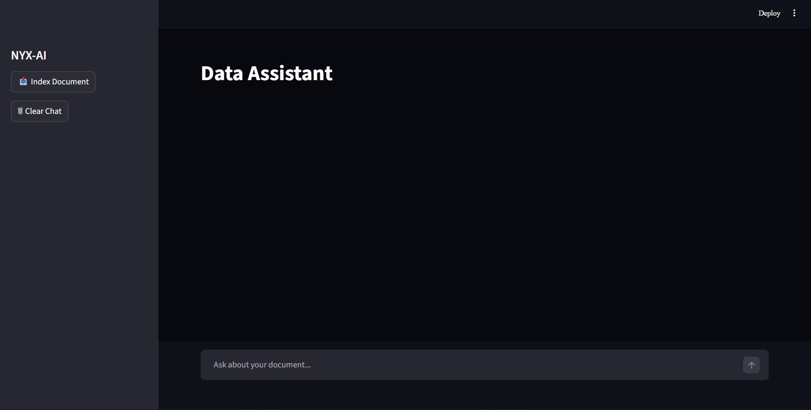
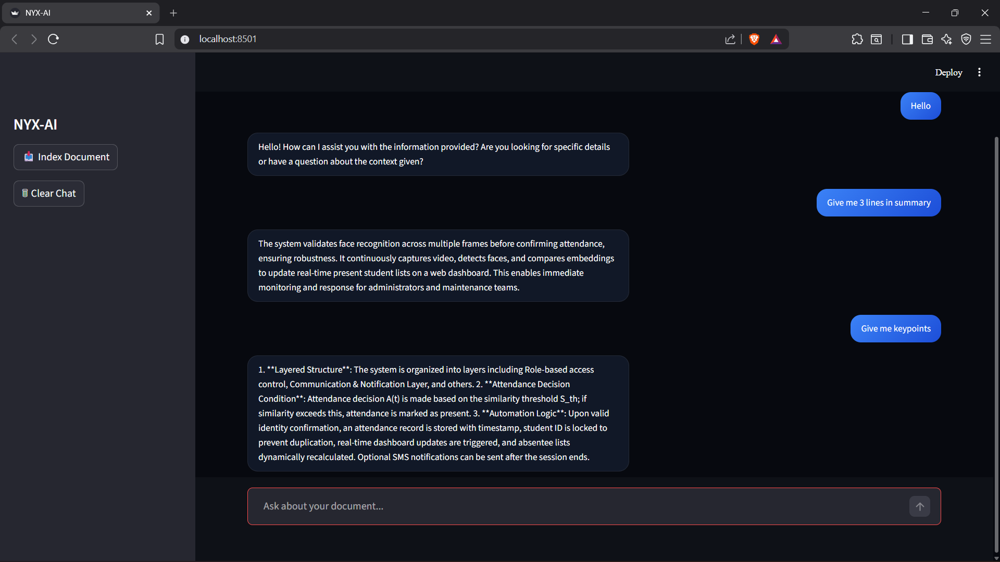

# NYX-AI – Document Intelligence Chatbot

RAG Chatbot using Python (AI Project)

NYX-AI is a **Retrieval-Augmented Generation (RAG)** chatbot that allows users to ask questions about a PDF document.  
It extracts content from documents, stores embeddings in a vector database, and generates answers using a local Large Language Model.

The application runs locally using:

- LangChain
- Ollama
- Chroma Vector Database
- Streamlit UI

---

## Architecture

PDF Document
↓
Text Chunking
↓
Embeddings (Ollama)
↓
Chroma Vector Database
↓
Retriever
↓
LLM (Ollama)
↓
Streamlit Chat Interface

---

## Features

- PDF document ingestion
- Vector-based semantic search
- Retrieval-Augmented Generation (RAG)
- Local LLM inference
- Streaming responses
- Clean chat interface

---

## Tech Stack

| Component | Tool |
|--------|--------|
| LLM Runtime | Ollama |
| Framework | LangChain |
| Vector Database | Chroma |
| UI | Streamlit |
| Embedding Model | nomic-embed-text |
| LLM | qwen2.5 / llama3 |

---

## Installation

### 1. Install Ollama

Download and install:

https://ollama.com/download

Start Ollama:

ollama serve

---

### 2. Install Models

ollama pull nomic-embed-text
ollama pull qwen2.5:3b

---

### 3. Install Python Dependencies

pip install -r requirements.txt

---

### 4. Run the Application

streamlit run app.py

---

## Environment Configuration

Create a `.env` file:

PDF_PATH=E:/Project/RMAS.pdf
COLLECTION_NAME=nyx_docs
DATABASE_LOCATION=./vector_db
EMBEDDING_MODEL=nomic-embed-text
CHAT_MODEL=qwen2.5:3b

---

## Performance Note

The system runs **Large Language Models locally**, which is computationally expensive.

When running on a **CPU-only laptop (e.g., Intel i5)**:

- Responses may take **10–40 seconds**
- Embedding generation can be slow
- LLM inference is CPU-bound

### Recommended Hardware

For better performance:

| Hardware | Recommendation |
|--------|--------|
| CPU | Intel i7 / Ryzen 7 |
| RAM | 16GB+ |
| GPU | NVIDIA GPU with CUDA |
| VRAM | 8GB+ |

Using a **GPU significantly speeds up LLM inference and embeddings**.

---

## Why Responses May Be Slow

This project runs **local Large Language Models** instead of cloud APIs.

Local models require:

- high RAM
- GPU acceleration
- large compute resources

Running these models on a standard **i5 CPU laptop** will result in slower responses.

---

## Demo

## Application Interface

## Demo Video

[Watch RAG Demo Video](rag-demo.mp4)

---

## Future Improvements

- GPU acceleration
- Hybrid search (BM25 + vectors)
- Multi-document support
- Faster embeddings
- Docker deployment

---
